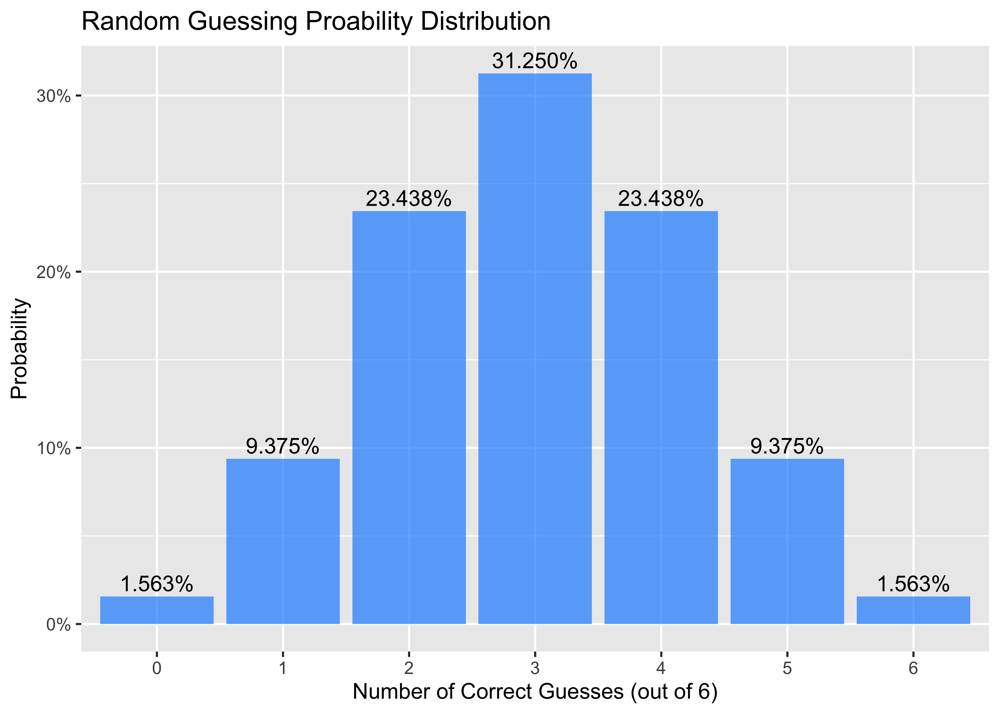
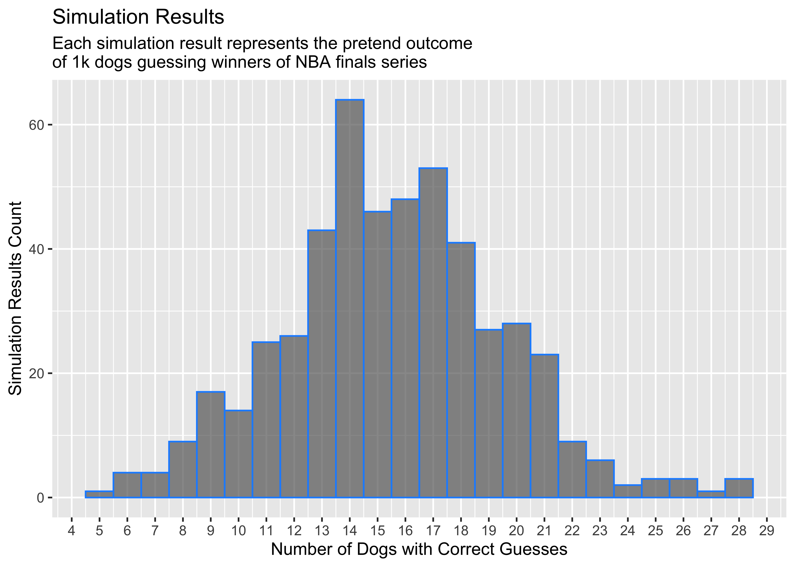

NBA Dog Genius?
================

``` r
library(tidyverse)
library(infer)
library(scales)
```

  
[Image Source](images.unsplash.com/photo-1554692901-e16f2046918a)

##### Background

  - [ESPN shared a cute
    video](https://www.youtube.com/watch?v=_cQGf5hKM4s) of a dog who
    “predicted” the outcome of the 2022 NBA finals 6 game series.
  - This story makes for a fun statistics/probability exercise.

##### Setup

  - NBA finals is a best of 7 series. First team to win 4 games is
    crowned champion.
  - The 2022 finals was a 6 game series. Warriors won in 6 games.
  - What’s the probability of a dog guessing the winners of a six game
    series?
  - What if we had 1000 dogs guess the six game series winners, what’s
    the probability we have at least one dog guess all games correctly?

##### What’s the probability of a dog guessing the winners of a six game series?

  - Let’s assume dogs don’t know basketball. A dog’s winning team guess
    for each game is like flipping a coin.
  - For simplicity, let’s also assume the probability of a team winning
    a game is 50% and is an independent event (e.g. winning the first
    game doesn’t change the proability of winning the second game).
  - There’s a \~1.56% chance that a dog guesses correctly for all six
    games. This concept is similar to the probability of flipping heads
    six times in a row (`(1/2)^6`) which is also \~1.56%.

<!-- end list -->

``` r
tibble(number_of_correct_guesses = 0:6) %>%
      mutate(probability =  
                   dbinom(number_of_correct_guesses, size=6, prob=.5)) %>%
      ggplot(aes(x=factor(number_of_correct_guesses),
                 y=probability)) +
      geom_col(fill="dodgerblue", alpha=0.7) +
      geom_text(aes(label=percent(probability,accuracy=.001)),
                vjust=-0.35) +
      scale_y_continuous(labels = percent_format(accuracy=1)) +
      labs(title = "Random Guessing Proability Distribution",
       x="Number of Correct Guesses (out of 6)",
       y="Probability")
```



##### What if we had 1000 dogs guess the six game series winners, what’s the probability we have at least one dog guess all games correctly?

  - Put the pencil and paper away. We’re going to let the computer do
    the heavy lifting.
  - We can simulate 1k dogs randomly guessing winners of the series.
  - The above probability distribution suggests we’d expect \~1.56% of
    the dogs to guess correctly (e.g. we’d expect around 16 dogs to
    guess correctly out of 1k). However, the actual number to guess
    correctly is expected to fluctuate due to natural variability.
  - Below we run a simulation 500 times where we have 1k “dogs” randomly
    guess winners. As expected, the bulk of the results are clustered
    around 16 correct guesses.
  - With the above assumptions, it is highly likely that at least one
    dog would guess correctly out of 1k dogs (let’s call it near 100%
    probability to be conservative). Said differently, out of 500
    simulation instances where 1k dogs randomly guessed winners, the
    minimum number of dogs to guess correctly was 6 out of 1k.

<!-- end list -->

``` r
### function that simulates 1k dogs randomly picking winners of the 6 game series
simulate_1k_dog_picks <- function() {
      ### pick a team W:warriors or C:celtics
      choices <- c("W", "C")

      ### actual winners from the 6 game series
      correct_guesses <- c("C", "W", "C", "W", "W", "W")
      
      trial_count <- 1000
      result <- tibble(trial_id = 1:trial_count) %>%
            rowwise() %>%
            ### for each trial id the "dog" selects winners for 6 games and 
            ### we count the number of correct guesses
            mutate(correct_guesses_count = 
                         sum(replicate(6, sample(choices, 1)) == correct_guesses)
            ) %>%
            ungroup() %>%
            summarise(number_of_dogs_with_correct_guesses = sum(correct_guesses_count==6)) %>%
            pull(number_of_dogs_with_correct_guesses)
      result
}

set.seed(4)
sim_results <- tibble(number_of_dogs_with_correct_guesses = replicate(500, simulate_1k_dog_picks()))

sim_results %>%
      ggplot(aes(x=number_of_dogs_with_correct_guesses)) +
      geom_histogram(binwidth=1, color="dodgerblue", fill="grey40", alpha = 0.7) +
      scale_x_continuous(breaks=0:100) +
      labs(title="Simulation Results",
           subtitle ="Each simulation result represents the pretend outcome
of 1k dogs guessing winners of NBA finals series",
           x="Number of Dogs with Correct Guesses",
           y="Simulation Results Count")
```



### What’s the catch?

  - ESPN or a news station obviously doesn’t report on all the dogs or
    other animals who incorrectly predict winners. The animal social
    media account with the correct predictions gets picked up. If 1k
    different animals made guesses on NBA series winners it is highly
    likely that at least 1 animal guesses correctly due to random
    chance.
  - Similarly, if 1k people flip a coin six times it is highly likely
    that several folks flip six heads in a row due to random chance.

### Disclaimer

  - No dogs were harmed as part of this analysis.
